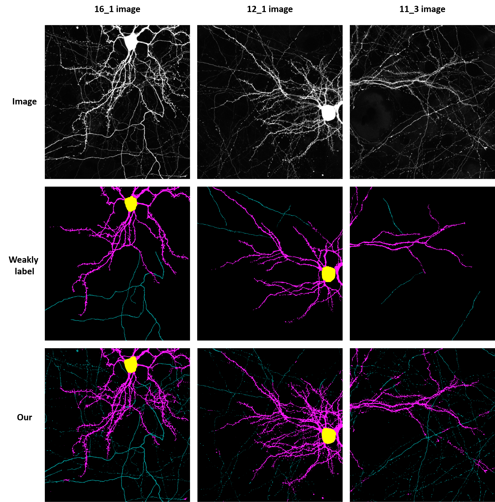
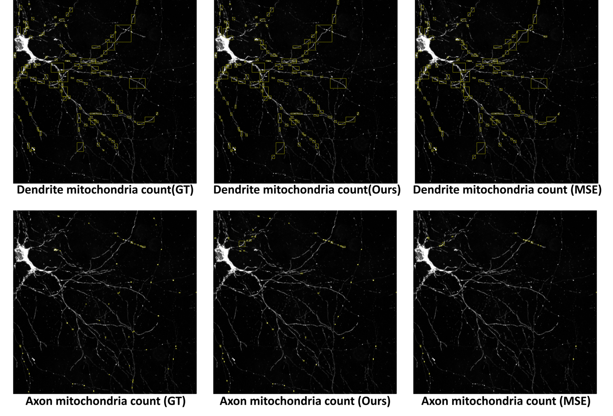

# Neuron segmentation using incomplete and noisy labels via adaptive learning with structure priors
Recent advances in machine learning have shown significant success in biomedical image segmentation. %with sufficient training data for supervised learning in biomedical image analysis.Most existing high-quality segmentation algorithms rely on supervised learning with full training labels. However, such methods are more susceptible to label quality; besides, generating accurate labels in biomedical data is a labor- and time-intensive task. In this paper, we propose a novel neuron segmentation method that uses only incomplete and noisy labels.The proposed method employs a noise-tolerant adaptive loss that handles partially annotated labels. Moreover, the proposed reconstruction loss leverages prior knowledge of neuronal cell structures to reduce false segmentation near noisy labels.the proposed loss function outperforms several widely used state-of-the-art noise-tolerant losses, such as reverse cross entropy, normalized cross entropy and noise-robust dice losses.

## datacode
* mydataset
   * mydataset2d
   * mydataset3d
* custom_transforms
   * intensity transform 
   * geometry transform 

## Model
* mynetwork
   * Unet
   * Unet ++
   * EfficientUnet
   * etc...
 
## utils
* logger
* matric
* ealry stopping

# Result
-----------

The ground truth (i.e full label) shows the result of cell counting for each structure.In the case of mitochondria in the dendrite part, the size of the mitochondria is generally large and has a lot of long linear characteristics~\cite{park2020super}, so in a test set with a total of 3 full labels, the number of cells of the proposed method is similar to that of MSE. Axons are generally short and have small morphological features~\cite{park2020super}, so  most mitochondria counting is not obtained in MSE, due to many unlabeled parts.On the other hand, the label obtained many counting after utilizing the proposed loss.Since my loss has improved a lot to the recall value, indicating that axon counts the cell similarly to GT.Through this result, I expected that when compared to the traditional method for obtaining mitochondria, the Network that applied the proposed network can be shortened in time to get mitochondria features and more detail about characteristics in a small area.

 
